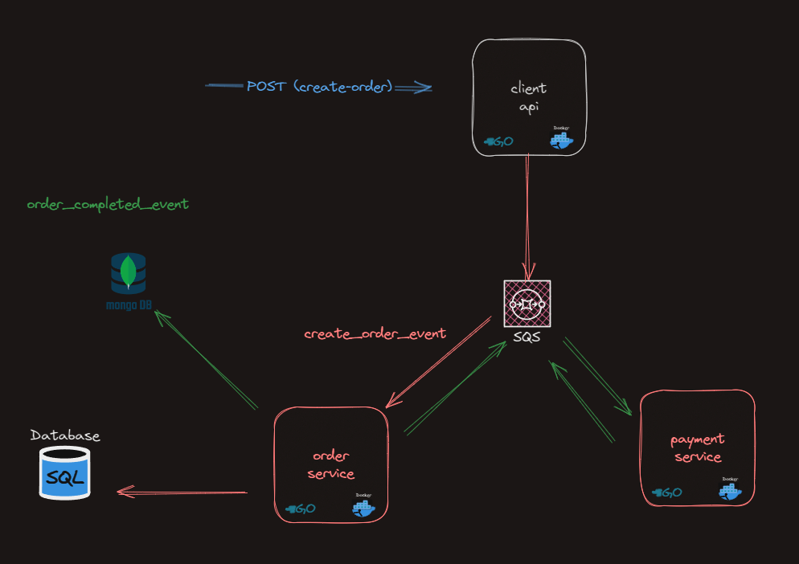

## Schema



## Overview

The system consists of three services: client_api, order_service, and payment_service. 
The responsibility of client_api is to prepare order requests from the user and forward them to order_service.
Additionally, it handles authentication.
The received order transactions are then transported to order_service through an 
SQS queue generated within a Docker image of LocalStack.

The order_service project functions as a consumer for messages coming from both the payment_service and the client_service.
It listens to different events from a single queue and performs necessary actions such as order_created and order_completed.

When it receives an order_created_event from the client_api, 
it conducts inventory checks and forwards the order to the payment_service for payment processing. 
The payment_service then performs necessary operations upon receiving this message and generates an order_completed_event, 
which is then transmitted back to the order_service.

## Installation
```command
 git clone github.com/mburaksoran/GetMobilCase
```

After cloning the GitHub repository, the following steps should be taken:

1. Ensure that the system has Docker installed. 
2. The project is written with Go v1.21.5; upgrading to this version may be required for the current setup.

All services can be brought up manually using Docker Compose or makefile also can be used 
if manually docker-compose file triggered, please make sure trigger the migration script.
migration script is responsible for creating testing data and also its create sqs queue for localstack.

```command
 docker compose up -d
```

## Usage

### Create Order

```shell
  curl --location 'http://localhost:8080/order' \
--header 'Content-Type: application/json' \
--data '{
    "product_id":1,
    "ordered_count":1,
    "user_id": 4,
    "price":10
}'
```
